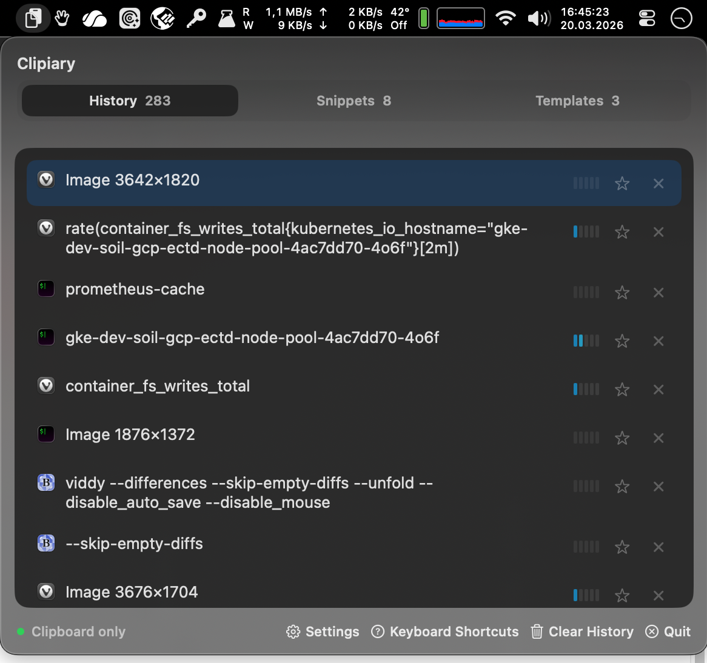
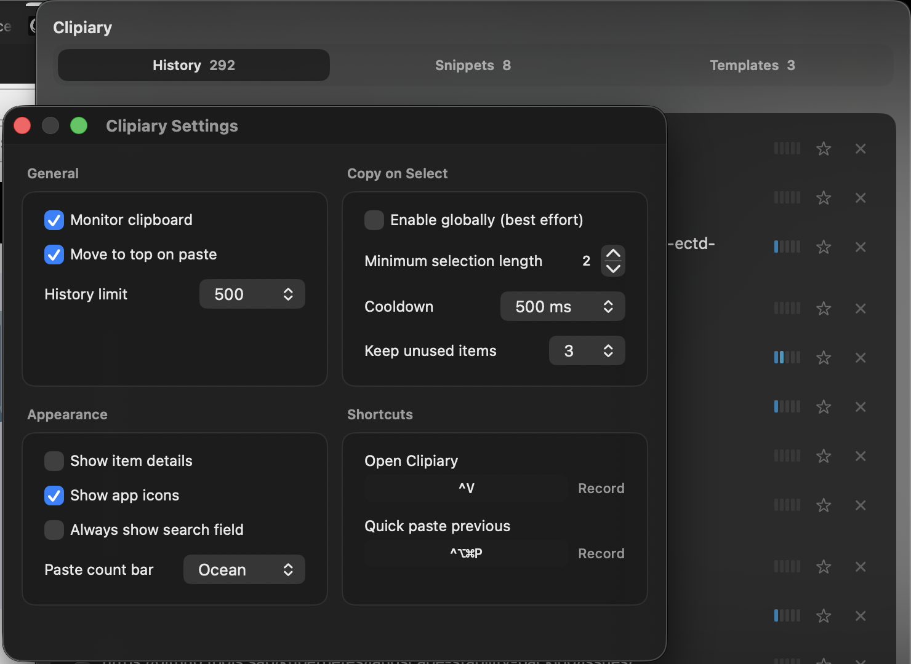

# Clipiary

Clipiary is a vibe coded macOS clipboard manager with powerful features and an optional global copy-on-select mode (works for most apps).




## Features

- **Clipboard history** — automatically captures text and images you copy, with configurable history limit
- **Copy-on-select** — optional global mode that captures text you highlight in any app (via Accessibility), without pressing Cmd+C
- **Quick paste previous** — global shortcut to instantly paste the second-most-recent item without opening Clipiary
- **Per-item global shortcuts** — assign a dedicated hotkey to any item for one-keystroke pasting
- **Favorites & custom tabs** — organize items into multiple named favorites tabs; manage tabs via right-click or a config file
- **Snippet descriptions** — add searchable descriptions to favorite items
- **Search** — filter clipboard history with a search field (always visible or auto-hide)
- **Item preview** — press **Space** to preview the full text or image of the selected item in a popover
- **Image support** — captures images copied to the clipboard with dimensions display and preview
- **Drag-and-drop reordering** — reorder items in favorites tabs by dragging
- **Paste count bar** — a colored frequency gauge on each item showing how often you paste it, with 8 color schemes
- **Auto monospace** — items copied from terminals or IDEs (Terminal, iTerm2, Ghostty, VSCode, Goland) automatically use a console font, with a configurable app list
- **Password manager awareness** — skips concealed, auto-generated, and transient clipboard items (e.g. OTP codes, passwords) from password managers
- **Per-app ignore list** — exclude specific apps from clipboard and copy-on-select capture by bundle ID
- **Move to top on paste** — optionally moves pasted items to the top of your history
- **Configurable appearance** — toggle app icons, item details (source app, capture time), and item line limit
- **In-app updates** — update Clipiary from within the app via the Sparkle framework
- **Keyboard-driven** — full keyboard navigation with arrow keys, Page Up/Down, Home/End, and configurable global shortcuts
- **Menu bar app** — runs as a lightweight macOS accessory app with no Dock icon

## Copy On Select

https://github.com/user-attachments/assets/b31bc9ed-20f9-4b12-a1cf-d55aba12d529

## Installation

Clipiary can be installed through my own homebrew tap:

```sh
brew tap liamhess/tap
brew install --cask clipiary
```

Since I don't pay for a Apple Developer ID you will have to access the untrusted signing in the Privacy & Security settings.

For the copy-on-select feature to work you will have to grant Accessibility rights.

## Usage

Clipiary lives in your menu bar. Click the icon or press **Cmd+Shift+V** (configurable) to open it. Use **arrow keys** to navigate, **Return** to paste, and **Cmd+D** to favorite an item.

**Quick paste previous** — Press **Ctrl+Opt+Cmd+P** (configurable) to instantly paste the second item from your history without opening Clipiary. Useful for swapping between two clipboard entries.

**Copy-on-select** currently works for many apps but not for all (depending on the apps specific accessibility settings).
You can configure the amount of latest copy-on-select items that should be kept in the history, to avoid polluting it with mouse selections that were never intended to be copied/pasted (copy-on-select items that were actually pasted are exempt from removal).

### Custom Favorites Tabs

By default there is a single "Favorites" tab. You can configure multiple named favorites tabs either by right-clicking a tab or by creating a config file at:

```
~/Library/Application Support/Clipiary/config.json
```

See [docs/config.example.json](docs/config.example.json) for a full template.


## Development

Development, release, and tap-maintainer notes live in [DEVELOPMENT.md](DEVELOPMENT.md).

The repo automation lives in `python3 tools/clipiary.py`, with no external Python packages required.
